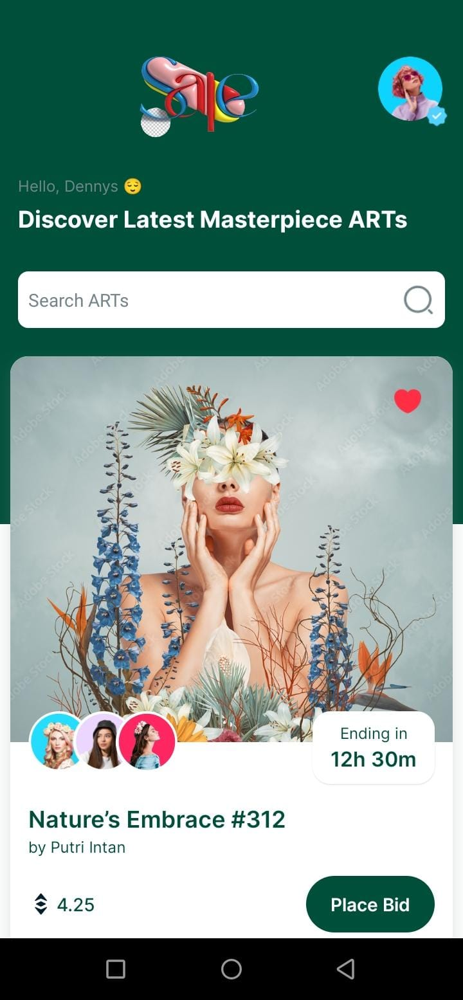

# ART Gallery App

## Description

This is a mobile application built using React Native that allows users to explore various pieces of art. Users can browse through different artworks, search for specific pieces, and enjoy a visually rich experience.

## Screens

#### Screenshots

    
    

### Home Screen

The Home screen displays a list of ART data. Users can search for specific ART items using the search bar at the top.

### Details Screen

The Details screen shows detailed information about a specific ART item selected from the Home screen. It displays the item's image, description, and any present bids.

## Installation

1. Clone the repository to your local machine.
2. Navigate to the project directory.
3. Run `npm install` to install the project dependencies.

## Usage

1. Ensure you have a compatible development environment set up for React Native.
2. Connect a mobile device or use an emulator/simulator.
3. To start the app in development mode, run `npm start` or `expo start`.
4. Use an Android or iOS emulator, or scan the QR code with the Expo Go app on your mobile device to run the app.

## Features

- View a collection of art pieces.
- Search for specific artworks by name.
- Enjoy a seamless browsing experience with smooth transitions.
- Responsive design for various screen sizes.

## Technologies Used

- React Native
- JavaScript
- CSS

## Credits

- This project utilizes open-source libraries for certain functionalities. Credits to the respective developers and contributors.
